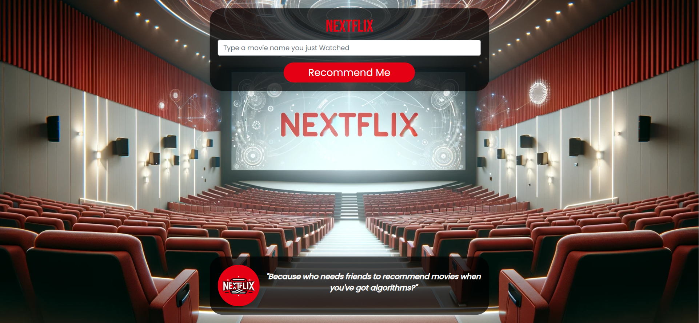
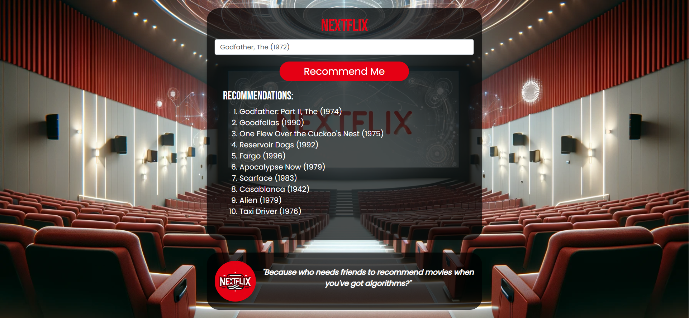

# NextFlix - Movie Recommendations

NextFlix is a web application that provides personalized movie recommendations. Utilizing machine learning algorithms to analyze user ratings, NextFlix offers suggestions based on a movie title input by the user. This project is built using Python, Flask, and leverages a dataset of movies and ratings to predict user preferences.

## Technologies & Libraries

- **Python**: Core programming language.
- **Flask**: Micro web framework for serving the application.
- **Pandas**: Data manipulation and analysis.
- **HTML/CSS**: Frontend presentation and styling.
- **Bootstrap**: For responsive web design.

## Machine Learning in NextFlix

The core of NextFlix's recommendation system is built on a collaborative filtering approach, leveraging user ratings to find similarities between movies. By preprocessing the dataset to create a user-item matrix and calculating Pearson correlation coefficients between movie ratings, NextFlix can suggest movies similar to a user's input.

## Setup & Installation

Ensure Python 3.10+ is installed on your system. Follow these steps to set up the project:

1. Clone the repository:
   ```bash
   git clone https://github.com/anayy09/NextFlix.git
   ```
2. Install dependencies:
   ```bash
   pip install -r requirements.txt
   ```
3. Run the Flask application:
   ```bash
   python app.py
   ```
4. Visit `http://127.0.0.1:5000/` in your web browser to use NextFlix.

## Usage

1. **Start Typing**: Begin by typing a movie title into the input field on the homepage.
2. **Select a Movie**: Choose the exact movie from the autocomplete suggestions.
3. **Get Recommendations**: Click on "Recommend Me" to view a list of recommended movies based on your selection.

## Deployment

NextFlix is deployed at [https://nextflix.onrender.com/](https://nextflix-bzej.onrender.com/), hosted on Render. This showcases the live application, allowing users to interact with the recommendation system.

## Screenshots

Here are some screenshots of the NextFlix application:




## Contributing

We welcome contributions to NextFlix! Whether it's bug reports, feature requests, or contributions to code, please feel free to make suggestions or pull requests.
